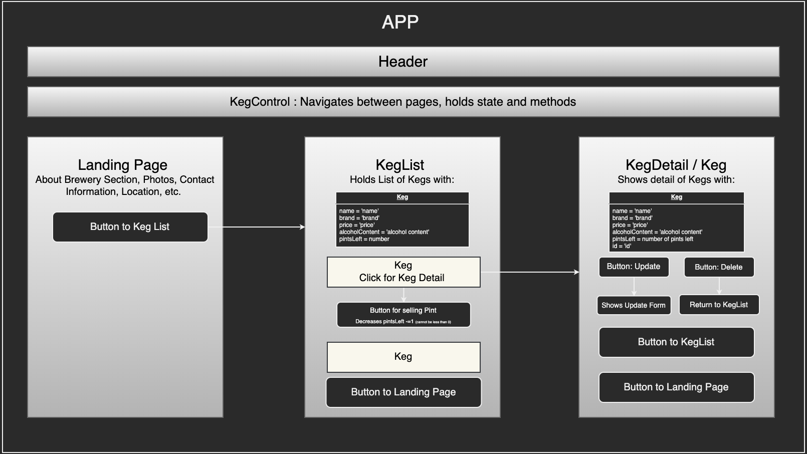

# Al's Taproom

#### Author: Allison Mackey July 3rd, 2020

### Description

A website for a taproom that allows the user to view landing page, view the menu/list with all available kegs, add a keg to the menu/list, and click a button to 'buy a pint' which will decrease the total pints left in that particular keg by 1. 

### Setup/Installation Requirements

View detailed set up instructions [here](./INSTALL.md)

### Known Bugs

When keg is selected the detail page only shows the first keg in the list, not the keg that was clicked on.

## Support and Contact Information

_Have a bug or an issue with this application? [Open a new issue](https://github.com/amackey693/brewery/issues) here on GitHub._

## Technologies Used

JavaScript, React, JSX, HTML, Node.js, Git and GitHub

## Specs

1. Allows user to view menu of all available kegs and details about the keg: name, brand, price and alcohol content.
2. Allows user to add a new keg to the available keg list
3. Allows user to click on a keg to see the detail page 
4. Allows user to see how many pints are left in a keg
5. Allows user to click a button next to the keg to sell a pint of beer and decreases the total pints left in the keg by 1.
6. Does not allow the number of pints to go below 0. 
7. Once the last pint has been sold it updates total pints left to 'Out of Stock'

### License

This software is licensed under the MIT license.

Copyright © 2020 **_Allison Mackey, Epicodus_**
